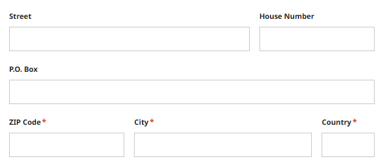

# SIX Web Components Prototyping Starter

This project serves as a **starter template** for prototyping applications using
[SIX Web Components](https://six-group.github.io/six-webcomponents/). It is built with [Angular](https://angular.dev/)
and leverages [Tailwind CSS](https://tailwindcss.com/) to enable rapid application development and iteration.

## Start prototyping locally

Before starting, ensure that **Node.js version 18.x or newer** is installed. You can then start the project by executing
the following commands:

```bash
git clone https://github.com/ibirrer/six-webcomponents-prototyping.git
cd six-webcomponents-prototyping
npm install
npm start
```

An example application will be available at: `http://localhost:4200/`.

## Utility Styles with Tailwind CSS Integration

This starter project includes a pre-configured **Tailwind CSS setup**, which allows you to use predefined utility
classes for colors, spacings, text sizes, shadows, and more. These
[utility classes](https://tailwindcss.com/docs/utility-first) should allow you to prototype quickly.

## Usage

Although SIX Web Components do not typically require custom CSS, Tailwind's utility classes can be very useful for
defining layouts (e.g., flexbox, grid) and creating custom components that complement SIX Web Components.

You can use most of the default utility classes from tailwind, like `flex`, `grid`, and so on, but colors and spacings
are restricted to the ones following to the SIX Styleguide.

### Spacings

Instead of numbers as used in the default tailwind config (e.g. `p-2`), the spacings are defined using names like small
(sm), medium (md), etc. Examples: `p-sm`, `p-ms`. Your IDE should provide autocomplete suggestions for the available
options. For a full reference, see [tailwind.config.js](tailwind.config.js).

### Colors

All colors specified in the SIX Web Components are available, such as `text-rock-800`. For further details on available
colors, refer to [tailwind.config.js](tailwind.config.js).

### Form Example

Here’s an example demonstrating how to use utility classes to build an address form layout:

```html
<form class="grid grid-cols-6 gap-md">
  <six-input class="col-span-4" label="Street" />
  <six-input class="col-span-2" label="House Number" />
  <six-input class="col-span-6" label="P.O. Box" />
  <six-input class="col-span-2" label="ZIP Code" required />
  <six-input class="col-span-3" label="City" required />
  <six-input class="col-span-1" label="Country" required />
</form>
```

This above code results in the following form layout:



## Example Application

This repository includes an example application located in [app.component.html](src/app/app.component.html). The entire
application is implemented within a single component, which is perfectly suitable—and even recommended—for prototyping
purposes. However, avoid this for building production-level applications.
